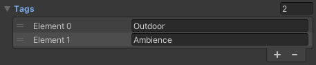

### Games By Johste presents: 
# Audio Engine for Unity

A simple audio engine intended to make audio engineers less reliant on a programmer to create, add and adjust music and sound effects. A.K.A Poor mans FMOD / Wwise.

Avoid hard coding audio settings: Music and sound effects settings are saved as configurable scriptable objects called "AudioEvents".

## Features:


### Preview AudioEvents settings in editor:


### Tweak AudioEvents at runtime and have changes reflected in game instantly without restarting:


### All built-in Unity filters supported and can be configured at runtime:


### AudioEvents support lists of Audioclips with configurable play order:

#### Play in order, Random but not twice or Random with no repeats.


### Group your audio events any way you like with custom tags:

#### Tag your AudioEvent:



#### Example usage: Find all "Outdoor" Audio Players using LINQ:
```
Audio.GetLivingAudioPlayers().Where(x => x.Tags.Contains("Outdoor")).ToList();
```


### If you need to modify settings from code, AudioPlayer supports chainable method calling:
```
Audio.Play("Demo Event").SetVolume(0.5f).SetPitch(2f);
```
```
AudioPlayer SetAudioClip(AudioClip clip);
AudioPlayer SetDelay(float constant, bool random, float min, float max);
AudioPlayer SetVolume(float constant);
AudioPlayer SetVolume(float min, float max);
AudioPlayer SetVolumeOverLifetime(bool enabled, float fadeInPosition, float fadeOutPosition);
AudioPlayer SetVolumeOverLifetime(bool enabled, AnimationCurve volumeOverLifetimeCurve);
AudioPlayer SetPitch(float constant);
AudioPlayer SetPitch(float min, float max);
AudioPlayer SetPitchOverLifetime(bool enabled, float fadeInPosition, float fadeOutPosition);
AudioPlayer SetPitchOverLifetime(bool enabled, AnimationCurve pitchOverLifetimeCurve);
AudioPlayer SetStereoPan(float constant, bool random, float min, float max);
AudioPlayer SetStereoPanOverLifetime(bool enabled, float fadeInPosition, float fadeOutPosition);
AudioPlayer SetStereoPanOverLifetime(bool enabled, AnimationCurve stereoPanOverLifetimeCurve);
AudioPlayer Set3DSoundSettings(float spatialBlend, float dopplerLevel, float spread, float minDistance, float maxDistance, AudioRolloffMode mode, AnimationCurve customCurve);
AudioPlayer SetPriority(int priority);
AudioPlayer SetAudioMixerGroup(AudioMixerGroup group);
AudioPlayer SetBypassEffects(bool bypass);
AudioPlayer SetBypassListenerEffects(bool bypass);
AudioPlayer SetBypassReverbZones(bool bypass);
AudioPlayer SetLoop(bool loop);
AudioPlayer SetAudioChorusFilterSettings(bool enabled, float dryMix, float wetMix1, float wetMix2, float wetMix3, float delay, float rate, float depth);
AudioPlayer SetAudioDistortionFilterSettings(bool enabled, float distortionLevel);
AudioPlayer SetAudioEchoFilterSettings(bool enabled, float delay, float decayRatio, float dryMix, float wetMix);
AudioPlayer SetAudioHighPassFilterSettings(bool enabled, float cutoffFrequency, float highpassResonanceQ);
AudioPlayer SetAudioLowPassFilterSettings(bool enabled, float cutoffFrequency, float lowpassResonanceQ);
AudioPlayer SetAudioReverbFilterSettings(bool enabled, AudioReverbPreset reverbPreset, float dryLevel, float room, float roomHF, float roomLF, float decayTime, float decayHFRatio, float reflectionsLevel, float reflectionsDelay, float reverbLevel, float reverbDelay, float hfReferance, float lfReferance, float diffusion, float density);
AudioPlayer SurviveSceneChanges();
AudioPlayer SetTags(List<string> tags);
AudioPlayer AddTag(string tag);
AudioPlayer RemoveTag(string tag);
```

### Automatic memory management built on top of Addressables:

#### Sounds are not loaded into memory before their needed and are released once their no longer needed.

## Dependencies:
    Unity 2021
    Unity.Addressables

## Install via git URL

Requires a version of unity that supports path query parameter for git packages (Unity >= 2019.3.4f1, Unity >= 2020.1a21). You can add https://github.com/johste93/gbj.audioengine.git?path=Assets/GBJ.AudioEngine to Package Manager

or add "gbj.audioengine": "https://github.com/johste93/gbj.audioengine.git?path=Assets/GBJ.AudioEngine" to Packages/manifest.json.

If you want to set a target version, gbj.audioengine uses the *.*.* release tag so you can specify a version like #0.0.2. For example https://github.com/johste93/gbj.audioengine.git?path=Assets/GBJ.AudioEngine#0.0.2.

## Getting Started:

#### 1. Create a new Audio Event inside a "Resource" directory: Create -> AudioEngine -> New Audio Event


#### 2. Give your audio event a unique name.


#### 3. Assign Audioclip(s) to your Audio Event. Configure your Audio Event settings as desired.


#### 4. To play your audio event. Simply call:
```
void Start()
{
    Audio.Play("Demo Event");
}
```

#### Or by referance:

```
public AudioEvent DemoEvent;

void Start()
{
    Audio.Play(DemoEvent);
}
```


## FAQ:

```
Q:  Error: AudioEvent {eventName} not found!
A:  Audio Events are loaded from Resources. 
    Make sure your audio event is located in a directory called "Resources" https://docs.unity3d.com/ScriptReference/Resources.html
```

```
Q:  I hear no sound when clicking the Play button on Audio Event.
A:  Make sure the Mute Audio Toggle Button on The Game View is not enabled.
```


## Improvement areas:

* Improve documentation
* Add more samples
* I like to find a way to use constants rather than strings to play audio events. This should make it easier to find and replace referances if name is changed.

PR's are welcome.
